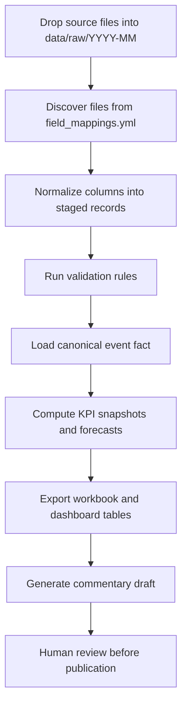

# Process Flow

## Monthly refresh

## Failure handling

- Missing required file: stop the run before staging.
- Validation errors above threshold: mark run as `warning` or `failed` depending on severity policy.
- Workbook export failure: keep mart tables but mark the run incomplete in `etl_run`.

## Logging expectations

Every run should capture:

- started timestamp
- finished timestamp
- reporting period
- source file count
- staged row count
- validation issue count
- run status
- operator notes
